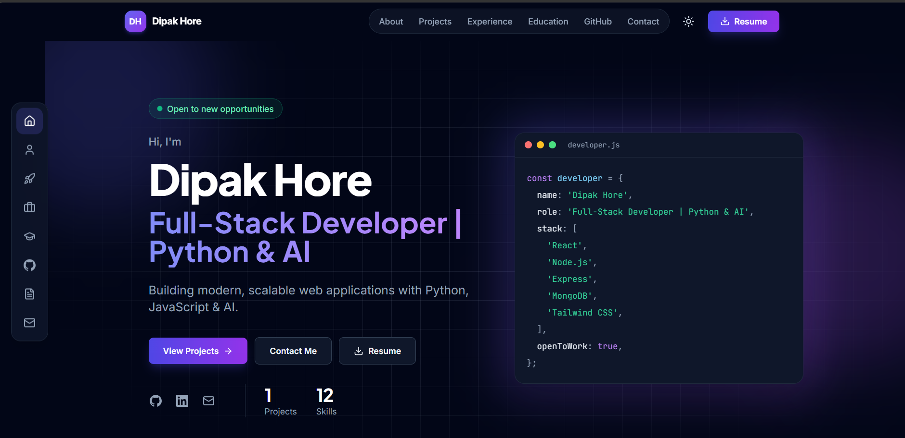
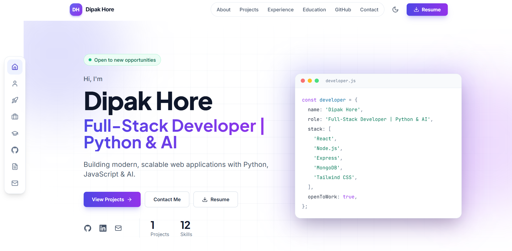
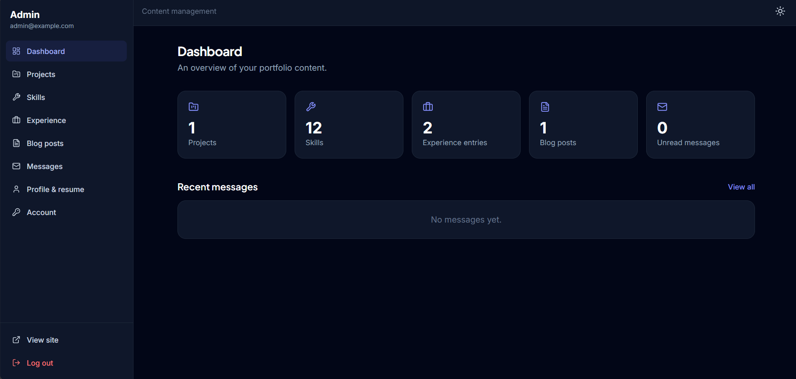
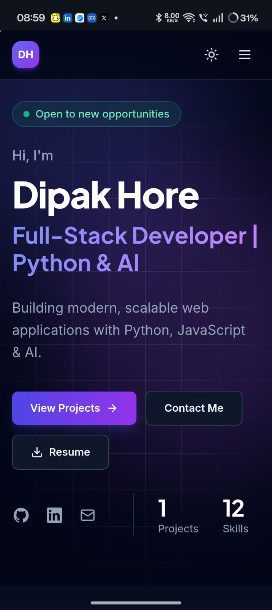
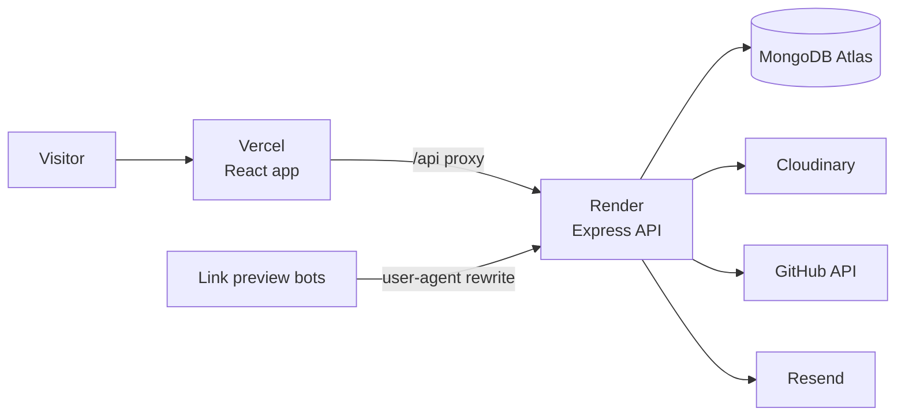

<div align="center">

# Dipak Hore | Portfolio

A full-stack personal portfolio with a built-in admin dashboard, so every project, skill and resume update happens from the browser instead of the code.

[**Live site**](https://my-portfolio-sooty-mu-80.vercel.app) · [Deployment guide](docs/DEPLOYMENT.md) · [Report an issue](https://github.com/dipakhore979/MY-PORTFOLIO/issues)




</div>

## Contents

- [Overview](#overview)
- [Screenshots](#screenshots)
- [Features](#features)
- [Tech stack](#tech-stack)
- [Architecture](#architecture)
- [Getting started](#getting-started)
- [Configuration](#configuration)
- [API reference](#api-reference)
- [Testing](#testing)
- [Deployment](#deployment)
- [Project structure](#project-structure)
- [Design decisions](#design-decisions)
- [Security](#security)
- [Known limitations](#known-limitations)
- [Author](#author)
- [License](#license)

## Overview

This project is my personal portfolio and a complete MERN application at the same time. Visitors see a single-page site with my projects, experience, education, live GitHub statistics and resume. I manage all of that content through a private dashboard that is protected by login, so changing a project description or uploading a new resume takes a minute and needs no redeploy.

The backend is a REST API with validation, rate limiting and an automated test suite. The frontend is a React app built with Vite and Tailwind CSS, deployed on Vercel in front of an API hosted on Render and a MongoDB Atlas database.

## Screenshots

| Home | Projects |
|---|---|
|  |  |

| Light mode | Admin dashboard |
|---|---|
|  |  |

<p align="center">
  
</p>

## Features

### Public site

- Single-page layout with eight sections: Hero, About, Projects, Experience, Education, GitHub, Resume and Contact
- Floating side dock that follows the section in view, plus a top bar for the same links
- Project grid with filtering by technology and a detail page for each project, written in Markdown
- GitHub section with public repositories, stars, followers and a language breakdown, fetched by the API and cached for an hour
- Resume section with an embedded PDF preview, download and full-screen view
- Contact form with client and server validation, a spam honeypot and email notification
- Light and dark theme that follows the system setting and remembers the visitor's choice
- Per-page SEO tags, JSON-LD, a generated `sitemap.xml` and a custom 404 page
- Link previews for LinkedIn, WhatsApp, X and Slack that show the right title and image for each project

### Admin dashboard

- Login with a JWT stored in an httpOnly cookie, and a password change page
- Create, edit and delete projects, skills, experience entries and blog posts, with draft support
- Markdown editor with live preview
- Image upload to Cloudinary, with a local-disk fallback for development
- Editable profile (name, tagline, bio, photo, links) and resume upload
- Message inbox with read and unread states

### Backend

- REST API organised as routes, controllers, models, services and middleware
- Joi validation on every write route, which also blocks unexpected fields and NoSQL operator injection
- Rate limits on login, the contact form and the API as a whole
- Centralised error handling that keeps internal details out of production responses
- Uploads checked by file signature rather than by the type the browser reports

## Tech stack

| Layer | Technology |
|---|---|
| Frontend | React 18, Vite, React Router, Tailwind CSS, Framer Motion, React Hook Form, Axios |
| Backend | Node.js, Express 4, Mongoose 8, Joi, JSON Web Tokens, bcryptjs, helmet |
| Database | MongoDB (Atlas) |
| Services | Cloudinary (images, resume), Resend or SMTP (email), GitHub REST API |
| Testing | Vitest, Supertest, GitHub Actions |
| Hosting | Vercel (frontend), Render (API), MongoDB Atlas (database) |

## Architecture



The site proxies `/api` to the API, so the browser only ever talks to one origin. The login cookie is therefore first-party and works in Safari as well as Chromium browsers.

## Getting started

**Prerequisites:** Node.js 18 or newer, and MongoDB running locally or a free [MongoDB Atlas](https://www.mongodb.com/atlas) cluster.

```bash
# 1. Clone and install both apps
git clone https://github.com/dipakhore979/MY-PORTFOLIO.git
cd MY-PORTFOLIO
npm run install:all

# 2. Configure the API
cd server
cp .env.example .env        # Windows: copy .env.example .env
# Set MONGODB_URI, JWT_SECRET, ADMIN_EMAIL and ADMIN_PASSWORD in .env

# 3. Create the admin user and starter content
npm run seed

# 4. Start the API on http://localhost:5000
npm run dev
```

In a second terminal:

```bash
cd client
cp .env.example .env
npm run dev                 # http://localhost:5173
```

Open `http://localhost:5173`, then `http://localhost:5173/admin` and sign in with the email and password from your `.env`.

> `npm run seed` replaces projects, skills, experience and posts with starter data. On a database that already holds real content, run `npm run seed:admin` instead. It only creates the admin user and profile.

### Scripts

| Location | Command | Purpose |
|---|---|---|
| server | `npm run dev` | API with automatic restart |
| server | `npm test` | Run the API test suite |
| server | `npm run seed` / `seed:admin` / `seed:destroy` | Load starter data, create only the admin, or clear content |
| client | `npm run dev` / `build` / `preview` | Dev server, production build, preview the build |
| root | `npm run lint` / `npm run smoke -- <api-url>` | Lint both apps, run post-deploy checks |

## Configuration

### Server (`server/.env`)

| Variable | Required | Purpose |
|---|---|---|
| `MONGODB_URI` | Yes | MongoDB connection string |
| `JWT_SECRET` | Yes | Signs login tokens (32+ random characters in production) |
| `CLIENT_URL` | Yes | Allowed site origin(s) for CORS, comma-separated |
| `ADMIN_EMAIL`, `ADMIN_PASSWORD` | For seeding | First admin account |
| `CONTACT_RECEIVER` | For email | Address that receives contact notifications |
| `RESEND_API_KEY` or `SMTP_*` | Optional | Email provider |
| `CLOUDINARY_*` | Recommended in production | Persistent image and resume storage |
| `GITHUB_USERNAME`, `GITHUB_TOKEN` | Optional | Override the GitHub user, or raise the API rate limit |
| `SITE_URL`, `COOKIE_SAMESITE`, `TRUST_PROXY` | Production | See the deployment guide |

The full, commented list is in [`server/.env.example`](server/.env.example).

### Client (`client/.env`)

| Variable | Purpose |
|---|---|
| `VITE_API_URL` | API base URL (`http://localhost:5000/api` locally, `/api` in production) |
| `VITE_SITE_URL` | Public site URL, used for canonical links and share images |

## API reference

Base path: `/api`. Read endpoints are public; write endpoints require the admin session cookie.

| Resource | Endpoints |
|---|---|
| Auth | `POST /auth/login`, `POST /auth/logout`, `GET /auth/me`, `PUT /auth/password` |
| Projects, skills, experience, posts | `GET /<name>`, `GET /<name>/:idOrSlug`, `POST /<name>`, `PUT /<name>/:id`, `DELETE /<name>/:id` |
| Profile | `GET /profile`, `PUT /profile` |
| Contact | `POST /contact` |
| Messages (admin) | `GET /messages`, `GET /messages/:id`, `PATCH /messages/:id`, `DELETE /messages/:id` |
| Uploads (admin) | `POST /upload/image`, `POST /upload/resume` |
| Other | `GET /github`, `GET /resume`, `GET /resume/info`, `GET /sitemap.xml`, `GET /health` |

List endpoints accept `page` and `limit`. Projects can be filtered with `?tech=React`, posts with `?tag=mern`. Unpublished items are only returned to a logged-in admin.

## Testing

The API has more than 160 automated tests (Vitest and Supertest) covering:

- login, sessions and tampered, expired or unsigned tokens
- validation, unexpected fields and injection attempts
- permissions on every protected route, and draft visibility
- uploads, rate limits, CORS and security headers
- the sitemap, link-preview pages and the GitHub endpoint

```bash
cd server
npm test
```

The tests need a running MongoDB and use a separate `portfolio_test` database. They refuse to start unless the database name ends in `_test`, so real data is never touched. Email and Cloudinary are disabled while they run. GitHub Actions runs the same tests and builds the client on every push.

## Deployment

The frontend runs on Vercel, the API on Render and the database on MongoDB Atlas. The full walk-through, including environment variables, the `/api` proxy and a troubleshooting table, is in [docs/DEPLOYMENT.md](docs/DEPLOYMENT.md).

## Project structure

```
.
├── client/                    React frontend (Vite)
│   └── src/
│       ├── admin/             Dashboard, loaded only on /admin
│       ├── api/               Axios client and endpoint helpers
│       ├── components/        Layout, page sections, shared UI
│       ├── context/           Theme and profile state
│       ├── hooks/             Data fetching, scroll tracking
│       └── pages/             Home, project and blog pages, 404
├── server/                    Express API
│   ├── src/
│   │   ├── controllers/       Request handlers
│   │   ├── middleware/        Auth, validation, errors, uploads, rate limits
│   │   ├── models/            Mongoose schemas
│   │   ├── routes/            Route definitions
│   │   ├── services/          Cloudinary, email and GitHub integrations
│   │   └── validators/        Joi schemas
│   └── tests/                 API test suite
├── docs/                      Deployment guide, screenshots
├── scripts/                   Post-deploy smoke test
└── .github/workflows/         CI: tests and client build
```

## Design decisions

- **API proxied through the frontend host.** Browsers such as Safari block cookies between two different domains. Proxying `/api` makes every request same-origin, which keeps the httpOnly login cookie working everywhere.
- **Link previews through a separate endpoint.** A React app is built in the browser, but the bots that create link previews do not run JavaScript. Vercel rewrites requests from those bots to an API route that returns a small HTML page with the right Open Graph tags, and everyone else gets the normal app.
- **GitHub data fetched and cached on the server.** Calling GitHub from every visitor's browser would hit its anonymous rate limit quickly. The API makes the requests, keeps the result for an hour and serves the last good numbers if GitHub is unavailable.
- **Validation before the database.** Joi schemas strip unknown fields and reject objects where strings are expected, which prevents mass assignment and operator injection with the same mechanism.
- **Generic CRUD controller.** Projects, skills, experience and posts share one controller factory, so permissions, pagination, slugs and image clean-up behave the same everywhere.

## Security

- Passwords are hashed with bcrypt (cost 12). Login is limited to 10 attempts per 15 minutes per IP.
- Sessions use an httpOnly cookie, marked `Secure` in production.
- There is no public sign-up route; the admin account comes from the seed script.
- Uploads are limited to 5 MB and verified by file signature. SVG uploads are not accepted.
- Secrets live in environment variables and `.env` files are git-ignored.

## Known limitations

- Link previews rely on Vercel rewrites, so they need adapting on another host.
- There is a single admin user and no password-reset email flow.
- Admin tables load the first 100 items of each resource.
- The test suite covers the API. The React app is checked by a production build in CI but has no browser tests yet.

## Author

**Dipak Hore**, full-stack developer

[GitHub](https://github.com/dipakhore979) · [LinkedIn](https://www.linkedin.com/in/dipak-hore) · [dipakhore979@gmail.com](mailto:dipakhore979@gmail.com)

## License

Released under the [MIT License](LICENSE).
