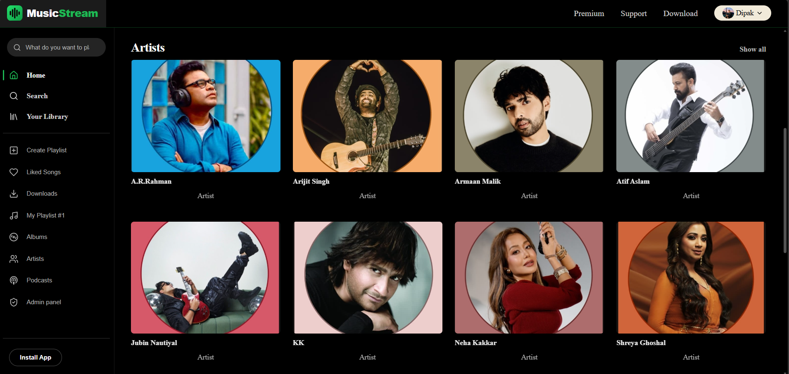

# MERN Portfolio

A full-stack personal portfolio with a built-in admin dashboard, so you can update projects, skills, experience, blog posts, your bio and your resume without touching code.

**Stack:** MongoDB · Express · React (Vite) · Node.js · Tailwind CSS · Framer Motion

## Features

### Public site
- One smooth-scrolling page with a floating side navigation dock (large screens): Hero, About (bio, photo, skills grouped by category), Projects, Experience, Education, GitHub highlights, Resume and Contact
- Projects grid with filter-by-technology and a detail page per project (Markdown)
- Blog with tag filter and Markdown post pages (optional: the section hides itself when empty)
- Contact form with client and server validation, spam honeypot and rate limiting. Messages are saved to MongoDB and emailed to you
- GitHub highlights: public repos, stars, followers and most-used languages, fetched by the API from GitHub's public API and cached for an hour
- Resume section with a PDF preview (desktop), download and full-screen buttons
- Optional blog: the pages (`/blog`) and the admin editor still exist, but the blog is not linked from the home page or menus
- Light / dark mode (follows the system, remembers your choice, no flash on load)
- Mobile-first responsive design, subtle Framer Motion animations (disabled for users who prefer reduced motion)
- SEO: per-page title, description, canonical and Open Graph / Twitter tags, JSON-LD, `robots.txt`, dynamic `sitemap.xml`, 404 page
- Link previews: LinkedIn, WhatsApp, X, Slack and similar crawlers get a per-project / per-post title, description and image (see `docs/DEPLOYMENT.md`, step 11)
- Accessibility: skip link, labelled forms, focus management on navigation, keyboard-friendly menus and dialogs

### Admin dashboard (`/admin`)
- Login with JWT in an httpOnly cookie, bcrypt password hashing, password change
- Create / edit / delete projects, skills, experience and blog posts (drafts supported)
- Markdown editor with live preview
- Image upload (Cloudinary, or local disk in development)
- Edit your name, tagline, bio, photo and links; upload your resume PDF
- Inbox for contact messages (read / unread, reply, delete)

### Backend
- REST API: routes → controllers → models, with middleware for auth, validation, errors, rate limiting and uploads
- Mongoose schemas: User, Project, Skill, Experience, Post, Message (plus a small Profile document)
- Joi validation on every write route (also blocks NoSQL operator injection)
- helmet, strict CORS with credentials, rate limits (login, contact, global), centralized error handling
- Uploads validated by file signature, not just the browser-reported type

## Project structure

```
.
├── client/                 React + Vite frontend
│   └── src/
│       ├── admin/          Admin dashboard (lazy-loaded, never shipped to visitors)
│       ├── api/            Axios client and endpoint helpers
│       ├── components/     layout, sections, ui
│       ├── config/site.js  Fallback name / bio / links
│       ├── context/        Theme and Profile contexts
│       └── pages/          Home, ProjectDetail, Blog, BlogPost, NotFound
├── server/                 Express API
│   └── src/
│       ├── config/  controllers/  middleware/  models/
│       ├── routes/  services/  utils/  validators/
│       └── seed/seed.js
│   └── tests/              API tests (Vitest + Supertest)
├── .github/workflows/ci.yml  Runs the tests and a client build on every push
├── docs/DEPLOYMENT.md      Step-by-step production guide
├── scripts/smoke-test.mjs  Post-deploy checks
└── render.yaml             Render Blueprint (optional)
```

## Run it locally

**Prerequisites:** Node.js 18+ and MongoDB (local install, or a free [MongoDB Atlas](https://www.mongodb.com/atlas) cluster).

```bash
# 1. Install dependencies
npm run install:all          # or: cd server && npm install; cd ../client && npm install

# 2. Configure the API
cd server
cp .env.example .env         # Windows cmd: copy .env.example .env
# edit .env: MONGODB_URI, JWT_SECRET (32+ chars), ADMIN_EMAIL, ADMIN_PASSWORD (10+ chars)

# 3. Add the sample data and your admin user
npm run seed

# 4. Start the API (http://localhost:5000)
npm run dev

# 5. In a second terminal, start the site (http://localhost:5173)
cd client
cp .env.example .env
npm run dev
```

Open <http://localhost:5173>, then <http://localhost:5173/admin> to log in with the `ADMIN_EMAIL` / `ADMIN_PASSWORD` you set.

### Useful commands

| Where | Command | What it does |
|---|---|---|
| server | `npm run dev` | API with auto-restart |
| server | `npm run seed` | Wipes projects/skills/experience/posts, loads sample data, creates the admin and profile if missing |
| server | `npm run seed:admin` | Only creates the admin user and profile. **Safe to run on a live database** |
| server | `npm run seed:destroy` | Clears projects, skills, experience and posts |
| client | `npm run dev` / `build` / `preview` | Dev server, production build, preview the build |
| server | `npm test` | API tests (see **Testing** below) |
| both | `npm run lint` / `npm run format` | ESLint / Prettier |
| root | `npm run smoke -- <api-url>` | Post-deploy checks (see `scripts/smoke-test.mjs`) |

> **Warning:** `npm run seed` deletes your content. Use `seed:admin` once you have real data.

## Environment variables

**Server (`server/.env`)**: see `server/.env.example` for the full, commented list.

| Variable | Required | Purpose |
|---|---|---|
| `MONGODB_URI` | yes | MongoDB connection string |
| `JWT_SECRET` | yes | Signs login tokens (32+ random characters in production) |
| `CLIENT_URL` | yes | Allowed website origin(s) for CORS, comma-separated |
| `ADMIN_EMAIL`, `ADMIN_PASSWORD`, `ADMIN_NAME` | for seeding | First admin user |
| `CONTACT_RECEIVER` | for email | Where contact notifications are sent |
| `RESEND_API_KEY` / `SMTP_*` | optional | Email provider (Resend over HTTPS, or SMTP) |
| `CLOUDINARY_*` | recommended in production | Persistent image and resume storage |
| `COOKIE_SAMESITE`, `TRUST_PROXY`, `SITE_URL` | production | See the deployment guide |
| `GITHUB_USERNAME`, `GITHUB_TOKEN` | optional | GitHub section. The username is read from the GitHub link in Admin → Profile unless you set it here; a token only raises GitHub's rate limit |

**Client (`client/.env`)**

| Variable | Purpose |
|---|---|
| `VITE_API_URL` | API base URL (`http://localhost:5000/api` locally, `/api` in production) |
| `VITE_SITE_URL` | Public site URL, used for canonical and share-image URLs |

## API overview

Base path `/api`. Reads are public; writes need the admin cookie.

| Resource | Endpoints |
|---|---|
| Auth | `POST /auth/login`, `POST /auth/logout`, `GET /auth/me`, `PUT /auth/password` |
| Projects, Skills, Experience, Posts | `GET /<name>`, `GET /<name>/:idOrSlug`, `POST /<name>`, `PUT /<name>/:id`, `DELETE /<name>/:id` |
| Profile | `GET /profile`, `PUT /profile` |
| Contact | `POST /contact` |
| Messages (admin) | `GET /messages`, `GET /messages/:id`, `PATCH /messages/:id`, `DELETE /messages/:id` |
| Uploads (admin) | `POST /upload/image`, `POST /upload/resume` |
| Misc | `GET /resume`, `GET /resume/info`, `GET /github`, `GET /sitemap.xml`, `GET /health` |

List endpoints accept `page` and `limit`. Projects accept `?tech=React&featured=true`, posts accept `?tag=mern`. Drafts are only returned to a logged-in admin.

## Testing

The API has an automated test suite (Vitest + Supertest, about 165 checks) covering login and sessions, token tampering, input validation, mass-assignment and NoSQL-injection protection, draft visibility, permissions on every protected route, the contact form, uploads, rate limits, CORS, the sitemap and link-preview pages.

```bash
cd server
npm install
npm test          # run once
npm run test:watch
```

- It needs a running MongoDB. By default it uses `mongodb://127.0.0.1:27017/portfolio_test`; set `TEST_MONGODB_URI` to use another one.
- **Safety:** the tests delete data, so they refuse to run unless the database name ends in `_test`. They never touch your normal `portfolio` database.
- Email and Cloudinary are switched off during tests.
- GitHub Actions (`.github/workflows/ci.yml`) runs the same tests against a MongoDB container and also builds the client on every push.

## Screenshots

Add your own screenshots to `docs/screenshots/` after you run the site. Suggested files:

| File | Capture |
|---|---|
| `home-light.png` | Home page, light mode |
| `home-dark.png` | Home page, dark mode |
| `projects.png` | Projects section with a filter applied |
| `project-detail.png` | A project detail page |
| `mobile.png` | Home page at phone width |
| `admin-dashboard.png` | Admin dashboard |
| `admin-editor.png` | Project edit dialog |

Then replace this paragraph with the images (uncomment and adjust):

<!--




-->

## Deployment

Frontend on **Vercel or Netlify**, API on **Render or Railway**, database on **MongoDB Atlas**. The full walk-through, including the cookie setup that works in Safari, is in **[docs/DEPLOYMENT.md](docs/DEPLOYMENT.md)**.

## Security notes

- Passwords are hashed with bcrypt (cost 12); login is limited to 10 attempts per 15 minutes per IP.
- The session cookie is `httpOnly`, `Secure` in production, and `SameSite` configurable.
- There is no public sign-up endpoint. The only admin is created by the seed script.
- Never commit `.env` files. Rotate `JWT_SECRET` if it is ever exposed (all sessions are then invalidated).
- Use a strong, unique admin password and keep Atlas and Cloudinary credentials out of the client.

## Known limitations

- **Link previews** need the bot rewrites in `client/vercel.json` (Vercel only). Netlify is not covered. Platforms cache previews, so use their debugger tools after changing a page.
- **Uploads that are never saved** (cancelled forms) stay in storage.
- The admin tables load the first 100 items per resource.
- There is one admin user and no password-reset email flow.
- The API tests cover the backend. There are no browser (end-to-end) tests for the React app; CI only checks that it builds.
